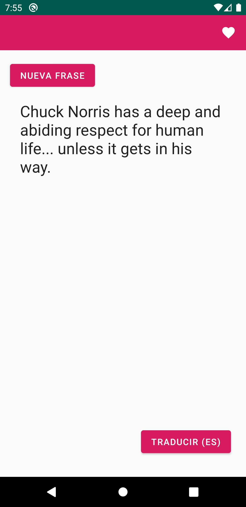
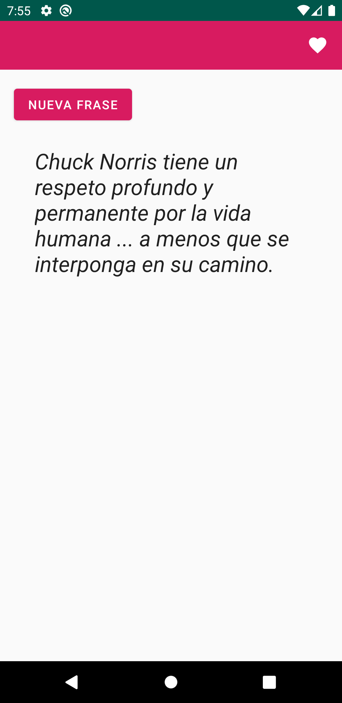
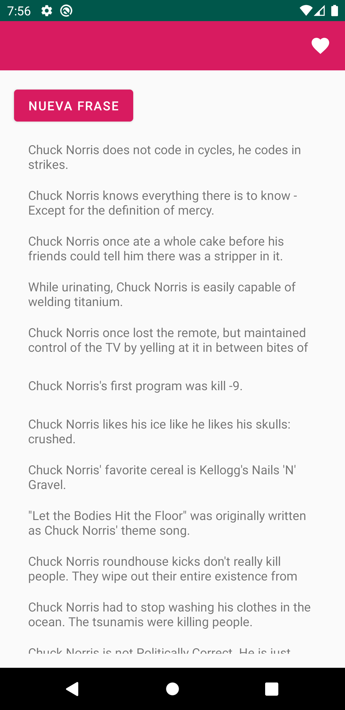

# Chuck Norris Quotes
App to practice serve as a POC base to experiment with different features, components, architectures.

## Worklog:
- 2018-12-28: Viper Architecture: Snapshot branch "viper".
- 2020-05-20: Jetpack Navigation applied, also migrate to androidx.
- 2020-05-27: Replace RxJava in favor of coroutines with testing supported: Snapshot branch "coroutines".

### Original quote from public 'jokes' API:

### Translated quote to spanish:

### Favs view:

